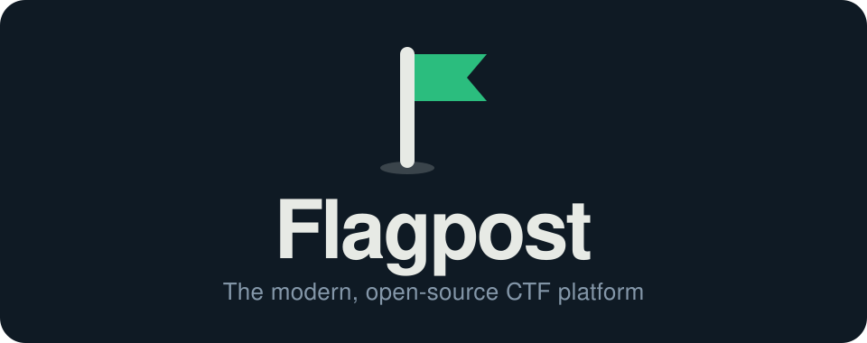
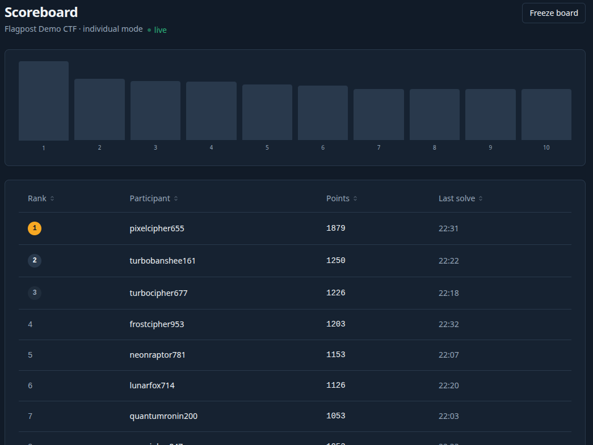
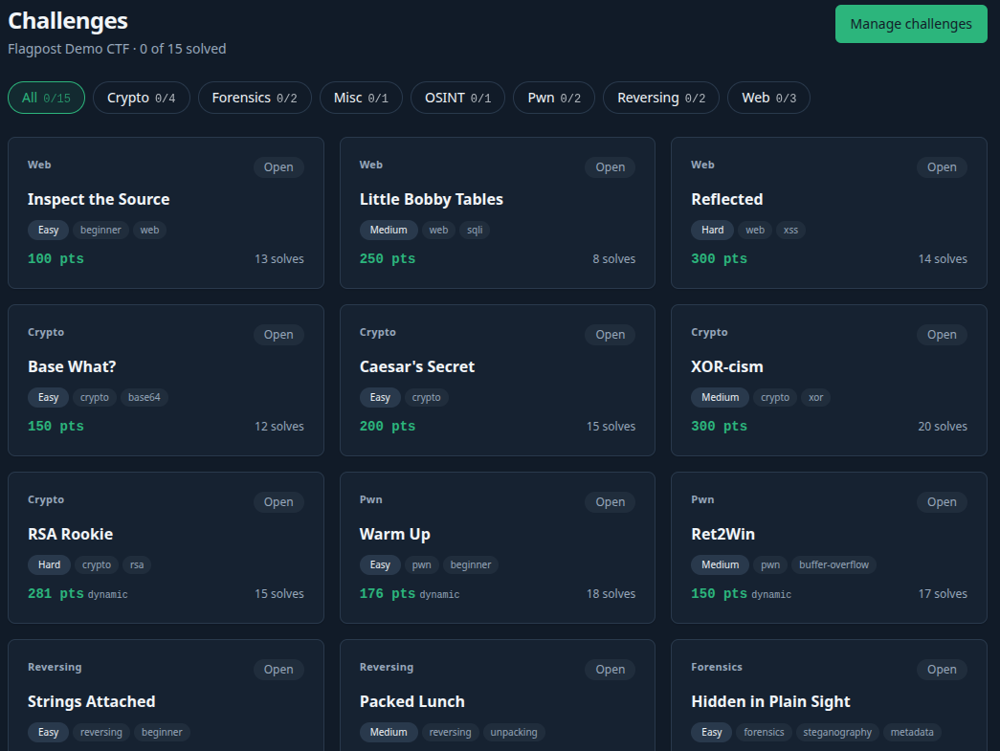
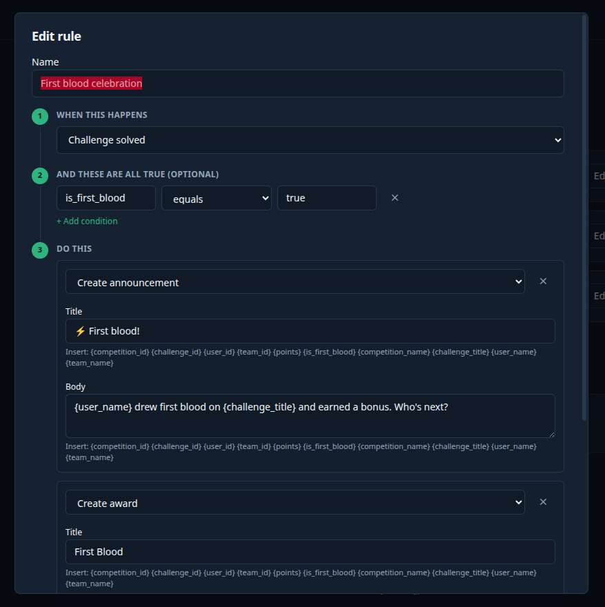
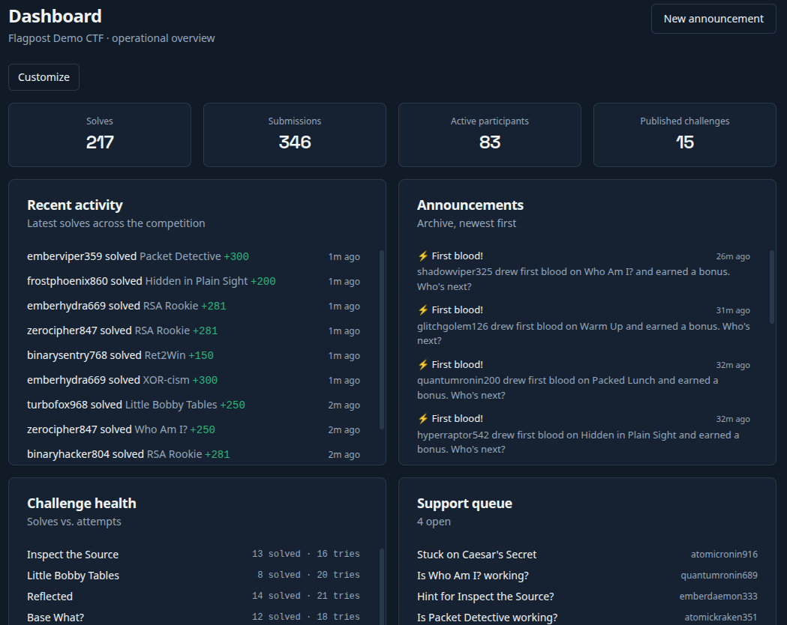

<div align="center">



**A modern, open-source platform for running Capture&nbsp;the&nbsp;Flag competitions —<br>self-hosted, real-time, and batteries-included.**

[](LICENSE)
[](https://github.com/tbcsec/flagpost/actions/workflows/ci.yml)
[](CONTRIBUTING.md)


[Highlights](#-highlights)&nbsp;·&nbsp;[Features](#-features)&nbsp;·&nbsp;[Quick start](#-quick-start)&nbsp;·&nbsp;[Deploy](#-deploying-to-production)&nbsp;·&nbsp;[Docs](#-documentation)

</div>

---

Flagpost is a complete competition platform for CTF organisers: publish challenges,
score solves the moment they land, support competitors, and automate the whole
event — all from one self-hostable app. It's multi-tenant from the ground up (run
many competitions from a single install), real-time throughout (WebSockets, not
polling), and ships as a one-command production stack.

Sign-in is local (username + optional email) or an external directory —
**OIDC/OAuth2** (Google, Okta, Keycloak, Entra, or anything with a discovery
document), **SAML 2.0**, or **LDAP / Active Directory**. An AI assistant is on
the roadmap but deliberately not built yet.

## ✨ Highlights

The things that set Flagpost apart — every one of them **built and working today**:

- **⚡ Real-time everything.** The scoreboard, "who's viewing this challenge"
  presence, notifications, and support-ticket threads all update live over
  WebSockets. No refreshing, no polling.
- **🤖 A visual automation engine.** A no-code **When → If → Then** rule builder:
  on any event, run actions — notify, call a (SSRF-hardened) webhook, send email,
  release a hint, unlock a bonus challenge, open a survey, adjust scores, grant an
  award, freeze the board, or post an announcement. Includes time-based triggers
  like *"an hour before the end, open the feedback survey."*
- **📝 Live collaborative notes.** True CRDT (Y.js) co-editing: a shared scratchpad
  per team on each challenge, and private staff notes on each ticket — everyone
  types at once, conflict-free.
- **🛡️ Permissions as data.** RBAC that isn't hard-coded: a visual role editor
  lets you clone the built-ins and craft custom roles with granular, per-competition
  or site-wide scope.
- **🧩 A genuinely deep challenge model.** Static, regex, and multiple-choice flags;
  dynamic (decay) scoring; prerequisite unlock chains; scheduled/waved release;
  tags & difficulty; and per-competition guess caps.
- **🏆 A scoreboard done right.** Live standings with first-blood, parallel
  **brackets/divisions**, a **freeze** for the final stretch, a public **spectator
  board**, and a **CTFtime feed** so rated events just work.
- **🔁 CTFd-compatible & fully portable.** Bulk challenge import/export in the
  **ctfcli YAML** format, plus a one-click, full-fidelity **platform backup**
  (export/import any section of your install).
- **🔐 Bring your own identity provider.** **OIDC/OAuth2** (PKCE, sub-first
  account linking, just-in-time provisioning), **SAML 2.0** (signature-before-
  trust, SP-metadata endpoint), and **LDAP / Active Directory** (a directory
  bind behind the ordinary login form) — alongside local accounts, so an
  existing Google/Okta/Keycloak/Entra/Shibboleth or on-prem directory just
  works, while local login stays as break-glass.
- **🔒 Secure by default.** argon2 hashing, a per-install auto-derived JWT secret
  (no shipped credentials — a first-run setup wizard creates your owner account),
  SSRF-hardened webhooks, ReDoS-contained regex flags, and timing-safe auth.
- **🚀 One command to production.** `docker compose up` brings up the whole stack
  behind a Caddy reverse proxy on a single origin — with automatic HTTPS when you
  point it at a domain.

## 📸 Screenshots

<table>
  <tr>
    <td width="50%" align="center">
      <br>
      <sub><b>Live scoreboard</b> — real-time standings, first blood, brackets &amp; freeze</sub>
    </td>
    <td width="50%" align="center">
      <br>
      <sub><b>Challenges</b> — cards, hints, live solves &amp; flag submission</sub>
    </td>
  </tr>
  <tr>
    <td width="50%" align="center">
      <br>
      <sub><b>Automation builder</b> — visual When → If → Then rules</sub>
    </td>
    <td width="50%" align="center">
      <br>
      <sub><b>Operational dashboard</b> — drag-and-drop widgets for organisers</sub>
    </td>
  </tr>
</table>

## 🧩 Features

<table>
<tr>
<td width="50%" valign="top">

**Competitions**
- Team **or** individual mode, per competition
- Public / private visibility & self-serve or invite-code join
- Schedule, **pause**, archive, and one-click **clone**
- **Rules / code of conduct** gate with recorded acceptance
- Archive **retention policy** with automatic purge
- Per-competition module toggles (turn features on/off)

**Challenges**
- Categories, static / regex / **multiple-choice** flags
- **Dynamic (decay)** or static scoring
- Hints, file attachments (S3/MinIO)
- **Prerequisite unlock chains**, scheduled release
- Managed **tags & difficulty** vocab
- Bulk **ctfcli YAML** import/export
- Manual guess-cap resets for multiple-choice

**Scoring & scoreboard**
- Live over WebSocket, **first-blood** markers
- **Dynamic value convergence** (all solvers stay fair)
- **Brackets / divisions**, scoreboard **freeze**
- Public **spectator board** (insight cards + live points
  timeline) and a **CTFtime feed**
- Manual judge awards & score adjustments

</td>
<td width="50%" valign="top">

**Teams & participants**
- Invite codes, optional **captain approval**, size caps
- Team profiles; individual-mode roster with standing

**Communicate & collaborate**
- **Support tickets** with a live staff queue, audio cue
  and **screenshot attachments**
- **Announcements** — severity ladder + audience targeting
- **Presence** — "N others viewing", "a judge is looking"
- **Collaborative CRDT notes** on challenges & tickets

**Automation, feedback & insight**
- Visual **automation** rule builder (§ Highlights)
- **Feedback surveys** + post-solve **challenge ratings**
- **Challenge & team analytics** + judge insight cards
- **Submissions browser** for dispute resolution (+ CSV)
- Operational **dashboard** with drag-and-drop widgets

**Administration**
- **OIDC / SAML / LDAP** identity providers alongside local accounts
- **Users** directory + soft-ban / lifecycle
- Data-driven **roles & permissions** editor
- Personal **API tokens** with platform-wide oversight
- **Email verification** & registration domain allowlist
- Site-wide **theming & branding** (custom logo, palettes)
- SMTP, registration policy, cross-competition **audit log**
- Full **export / import** backup (incl. secrets)

</td>
</tr>
</table>

## 🚀 Quick start

Requires [Docker](https://docs.docker.com/get-docker/) with Compose. The default
stack is **production**: built images behind a Caddy reverse proxy, with Postgres,
Redis, and MinIO.

```bash
git clone https://github.com/tbcsec/flagpost.git
cd flagpost
docker compose up --build
```

Open **http://localhost:8080** and complete the one-time **setup wizard** to
create your owner account. That's it — the app, its API, and its live WebSocket
updates are all served same-origin through Caddy, so there's nothing else to
configure for a local run.

> A fresh install ships with **no administrator** and no default password. It's
> unconfigured until you complete the setup wizard, which creates the owner
> account and initial branding.

## 🌐 Deploying to production

The default compose *is* the production stack, so going live is mostly
configuration in `.env` (copy `.env.example`):

| Variable | What it does |
|---|---|
| `SITE_ADDRESS` | Your domain, e.g. `ctf.example.com`. Caddy obtains & renews **TLS automatically**. Map ports `80` + `443`. |
| `PUBLIC_ORIGIN` | The browser-facing origin, e.g. `https://ctf.example.com`. Baked into the frontend at build time — set it before `docker compose build`. Also what OIDC redirect URIs are built from, so it must be exact if you configure SSO. |
| `JWT_SECRET` | A long random value (required for multi-host; otherwise the app derives and persists one). |
| `POSTGRES_PASSWORD`, `MINIO_ROOT_USER/PASSWORD` | **Real credentials — generate with `openssl rand -hex 24`.** Compose falls back to well-known development values so a local run needs no config, but those are published defaults, not secrets. |
| `MINIO_PUBLIC_ENDPOINT` | A browser-reachable MinIO host for signed attachment downloads. |

> **The backend refuses to start** if it finds MinIO's default credentials on a
> deployment that looks reachable — `PUBLIC_ORIGIN` naming a non-local host, or
> `MINIO_PUBLIC_ENDPOINT` being set. Browsers fetch attachments straight from
> the S3 API, so it has to be reachable, and default credentials there mean
> world read/write on every challenge attachment — including unreleased ones —
> outside RBAC entirely. Note that `MINIO_ROOT_USER`/`MINIO_ROOT_PASSWORD`
> *initialise* the MinIO server rather than reconfigure it: changing them after
> first boot needs `docker compose up -d --force-recreate minio`, and a rotation
> on a stack that already holds data has to be done inside MinIO too.

The backend runs as a **single process by design** (the WebSocket layer is
in-process). To run **without Docker**: build & serve the frontend with
`npm run build && npm run start`, and run the backend with `alembic upgrade head`
then `uvicorn main:app` (no `--reload`) behind your own TLS-terminating proxy.

### 📌 Versioned images (pull instead of build)

Every release tag publishes **pinned, reproducible images** to GHCR — pick a tag
from [Releases](https://github.com/tbcsec/flagpost/releases):

```
ghcr.io/tbcsec/flagpost-backend:vX.Y.Z    (also :latest)
ghcr.io/tbcsec/flagpost-frontend:vX.Y.Z   (also :latest)
```

The release frontend is built in **same-origin mode** — API calls and
WebSockets resolve against whatever origin serves the page — so one image works
behind any single-origin proxy with no baked-in domain and no `PUBLIC_ORIGIN`
rebuild. Point the compose `frontend`/`backend` services at these images (a
two-line override) to upgrade by tag instead of rebuilding from source.

A release image reports its exact tag as the running version; a build from
source reports the release it's based on with an `-src` suffix (e.g.
`1.3.0-src`), since `main` starts accumulating the next version the moment a tag
is cut.

## 🛠️ Local development

The dev stack mounts source and runs hot-reloading dev servers:

```bash
docker compose -f docker-compose.dev.yml up --build
# frontend → http://localhost:3000   ·   backend → http://localhost:8000/docs
```

Or run each side directly (backend needs Python 3.12+ and a venv; frontend needs
Node 20+ — the shipped images run 3.14 and 26, which is what CI tests):

```bash
# Backend
cd backend && python3 -m venv .venv
.venv/bin/pip install -r requirements-dev.txt
.venv/bin/alembic upgrade head        # against a reachable Postgres
.venv/bin/uvicorn main:app --reload

# Frontend
cd frontend && npm install && npm run dev
```

Run the checks CI runs before opening a PR:

```bash
cd backend  && .venv/bin/pytest        # SQLite-backed, no infra needed
cd frontend && npx tsc --noEmit && npx eslint .
cd frontend && npm run test            # vitest
cd frontend && npm run build           # catches prerender-only failures
```

CI also runs `alembic upgrade head` against a real PostgreSQL, because the test
suite builds its schema from the models rather than by running migrations
(ADR-0006) — so a broken migration only shows up there. Run the production stack
once before shipping one.

## 🧱 Tech stack

**Backend** — Python · FastAPI · SQLAlchemy 2 (async) · Alembic · PostgreSQL ·
Redis · MinIO/S3 · JWT + argon2 + OIDC/SAML/LDAP · a first-class async event bus.
**Frontend** — TypeScript · Next.js 15 (App Router) · React 19 · TanStack Query ·
Zustand · Tailwind v4 · TipTap + Y.js (CRDT).
**Realtime** — WebSockets throughout. **Deploy** — Docker Compose + Caddy.

## 📚 Documentation

| Doc | What's in it |
|---|---|
| [`docs/VISION.md`](docs/VISION.md) | What Flagpost is and why it exists |
| [`docs/ARCHITECTURE.md`](docs/ARCHITECTURE.md) | The binding technical design |
| [`docs/ROADMAP.md`](docs/ROADMAP.md) | Build order and what's next |
| [`docs/adr/`](docs/adr/) | Architecture Decision Records — *why* things are the way they are |

## 🤝 Contributing

Contributions are welcome! Start with [`CONTRIBUTING.md`](CONTRIBUTING.md) for
setup, conventions, and the PR flow, and please follow the
[Code of Conduct](CODE_OF_CONDUCT.md).

Found a security issue? **Don't** open a public issue — see
[`SECURITY.md`](SECURITY.md) for private disclosure.

## 🔒 Privacy

Your competitions, users and submissions never leave your infrastructure. The
only thing Flagpost sends out is a **once-daily update check** that carries your
version number and nothing else — no identifier, no hostname, no user data. The
count of those requests is how the project gauges how many deployments are live.

Turn it off in Admin → Site settings, or set `UPDATE_CHECK_URL=""` to make sure
the call is never attempted at all. Full detail in [`PRIVACY.md`](PRIVACY.md).

## 📄 License

Copyright © 2026 **Tom Collier**.

Flagpost is licensed under the **[GNU Affero General Public License v3.0](LICENSE)**.
You're free to use, modify, and self-host it; if you run a **modified** version as
a network service, the AGPL's §13 requires you to offer your users its source. The
built-in "Powered by Flagpost" footer links every page to this repository, which
is how Flagpost surfaces its source to remote users.

<div align="center"><sub>Built for the CTF community. Fly your flag. 🚩</sub></div>
